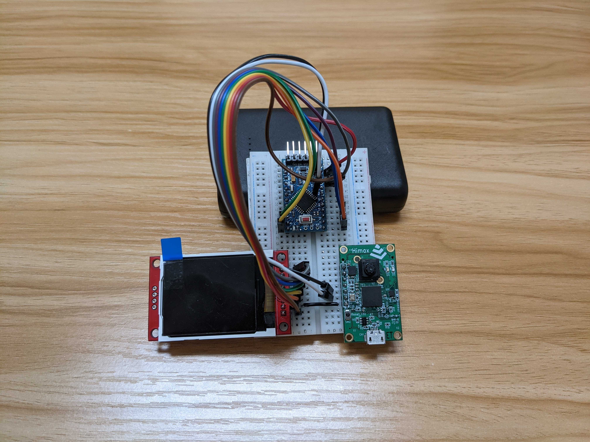
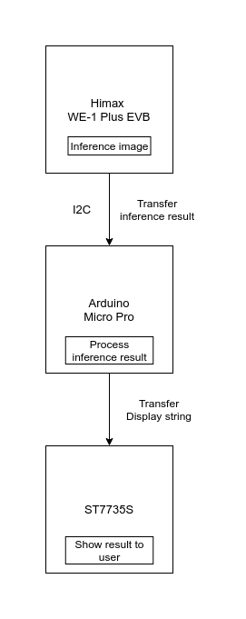
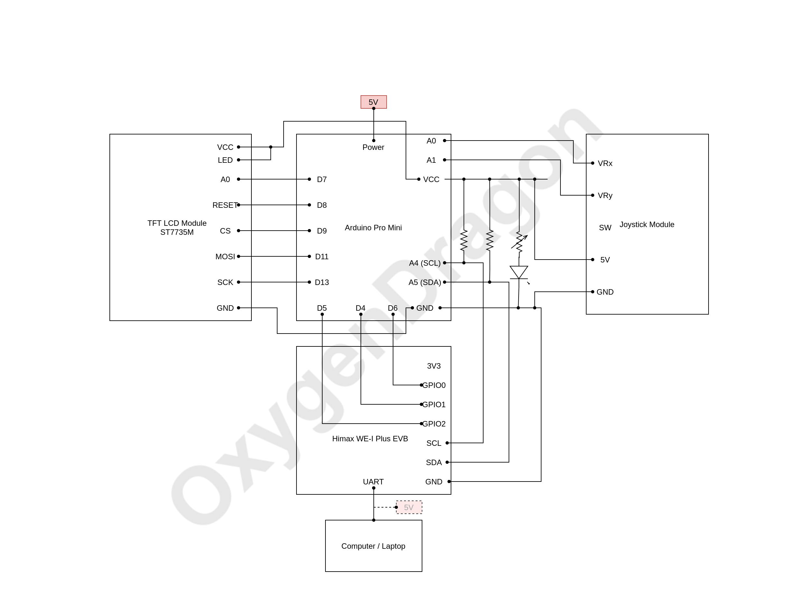
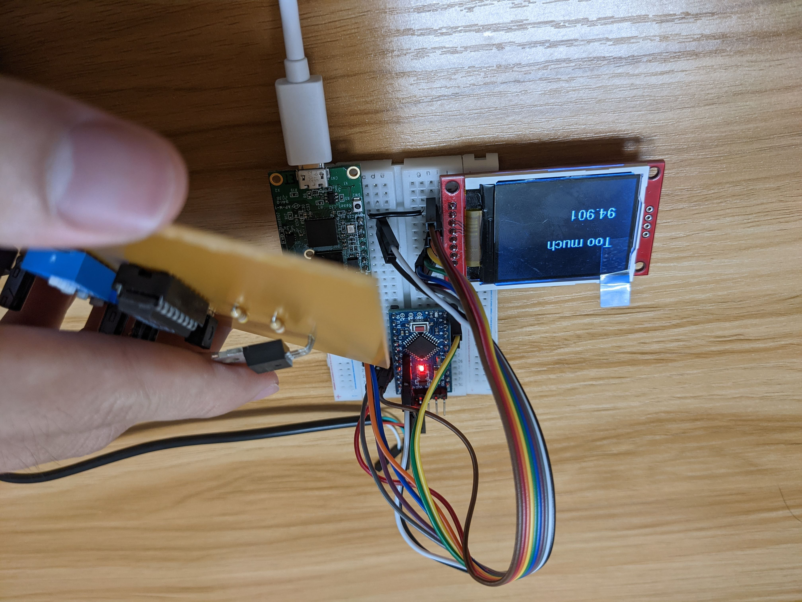
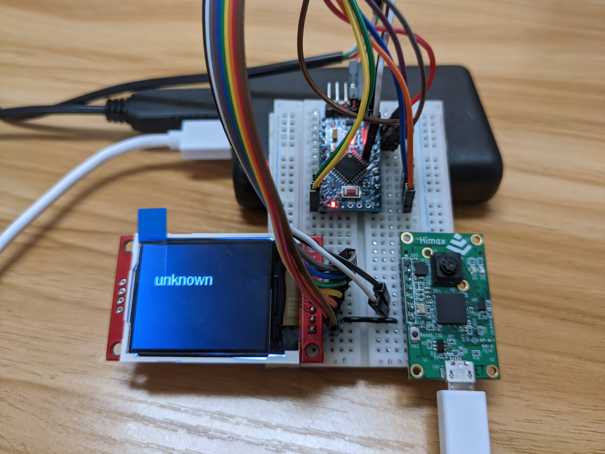

# PCB Solder Joint Classification System

## Introduction

We are group from NCKU CASLab. We are dedicate to solve the problem of solder joint classification problem. Since inspecting solder joint defect by human eye is time consuming and low efficiency, we propose a classification system with edge AI. Our device could work only with power supply and need no computer or laptop connect to it.  Hope this AIoT device could solve the problem people long encountered.

<p align="center">

</p>
<p align="center">Device Image</p>


## Develop Board/Module

- Himax WE-1 Plus EVB
  - Edge AI development board, for real time inference
  - [Source Code](https://github.com/choucl/solder-joint-classfication/tree/master/ARC_SDK)

- Arduino Mini Pro
  - Master device for displaying inference output
  - [Source Code](https://github.com/choucl/solder-joint-classfication/tree/master/tft_display)
- ST7735
  - LED display, for showing the classification result to user


## Hardware Architecture

<p align="center">

</p>

## Schematic Diagram

<p align="center">

</p>


## Deploy Steps

- Himax WE-1 Plus EVB

  1. create img file for the board

  ```bash
  $ cd ARC_SDK
  $ make clean
  $ make && make flash
  ```

  2. burn the img file to the board

  ```bash
  $ ls /dev      # check board connect port
  $ sudo minicom # one should connect to board port
  # reset the board and choose the img file to burn
  ```

- Arduino micro pro
  1. upload the sketch in `tft_display/` to your Arduino
  2. one should notice that library `Adafruit_GFX` and `Adafruit_ST7735` should be installed first to make it work properly


## Implementation Details

### Training

- Model: CNN
- Training Dataset
  - Wild dataset collected from internet
  - Capture pictures from real PCB board
  - Total image of 1126 pics
- Model Classification Target
  - **Normal**: normal joints
  - **Cold Joint**: joints generated when soldering temperature is not high enough, might cause circuit stability problem
  - **Overheat**: joints generated when soldering temperature is too high, might cause circuit stability problem
  - **Too much**: using too much solder when soldering, having high probability to cause short circuit
  - **Insufficient**: not enough solder when soldering, might cause malfunction of circuit
  - **Short**: two or more solder joint connection, might cause malfunction of circuit
- Accuracy: 81% of accuracy of classification


### Deployment of WE-1 Plus

- Deploy model: Tensorflow lite with post training quantization of int8
- Input image: 128x128x1, gray scale image captured by HM0360 module implemented on WE-1 plus
- Original image pixels is int8 format, normalize it before invoke inference
- Send inference result to Arduino with I2C


### Display Output

- Showing classification category result
- Showing confidence percentage of the very classification
- If all category confidence is lower than 50%, show unknown instead

  

## Demo Image


<p align="center">

</p>
<p align="center">Classfication Result (Too much)</p>

<p align="center">

</p>
<p align="center">Classfication Result (Unknown)</p>

