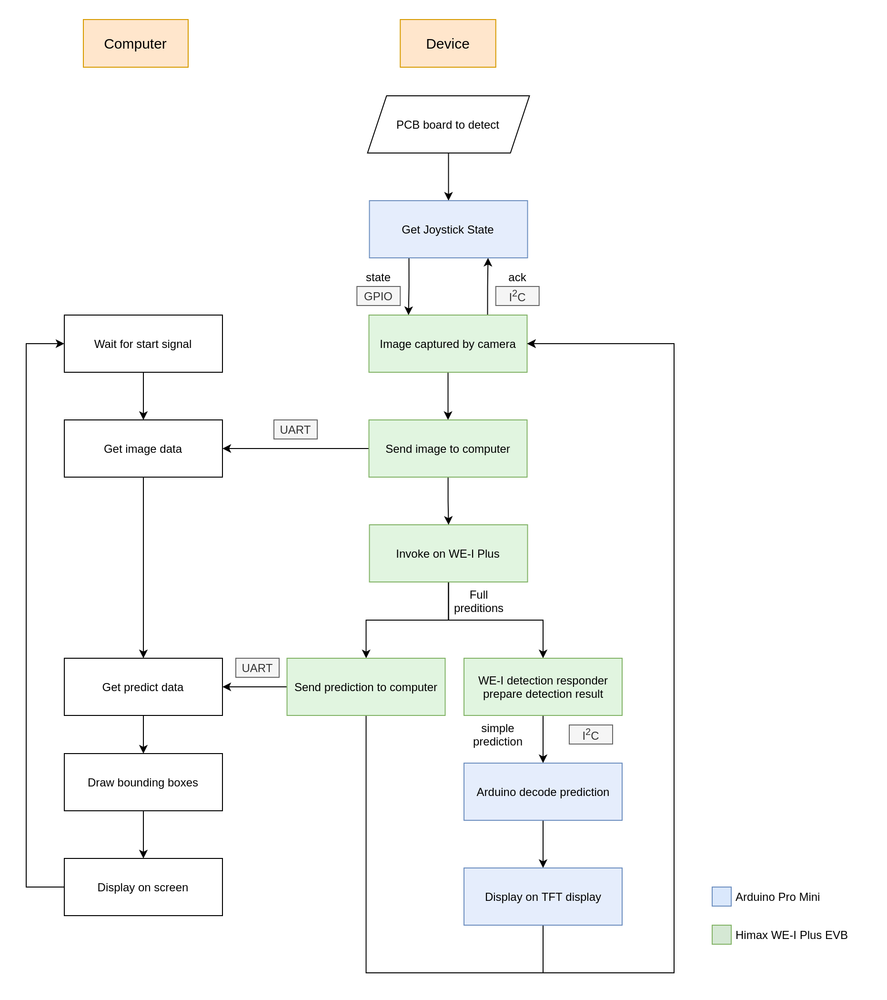
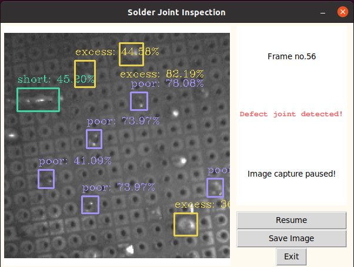
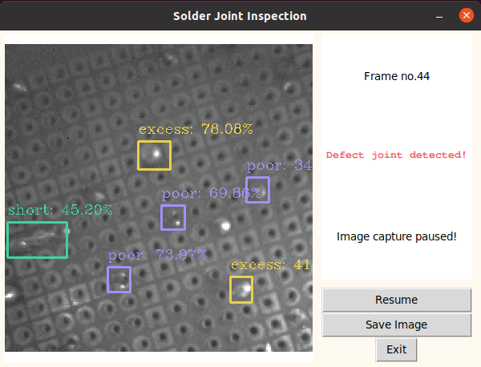

# PCB Solder Joint Detection System

## Introduction

We are group from NCKU CASLab undergraduate students. We are dedicate to solve the problem of solder joint detecting problem. Since inspecting solder joint defect by human eye is time consuming and low efficiency, we proposed a detection system combine with edge AI and computer. Our device could also work only with power supply and need no computer or laptop connect to it.  Hope this AIoT device could solve the problem people long encountered.

<p align="center">

</p> 
<p align='center'>Device Image</p>


## User Manual

### Installation

1. Compile and generate image file for uploading to Himax WE-I Plus EVB

   Before started, make sure that `lrzsz` is installed in your computer

   ```bash
   $ cd himax_tflm && make downloads # download himax sdk
   $ cd ARC_SDK
   $ make clean
   $ make && make flash
   ```

   You should see `output_gnu.img` in this folder after this step.

2. Deploy image to Himax WE-I Plus EVB, we use `minicom` and `xmodem` here, connect Himax WE-I Plus EVB to your device first

   ```bash
   $ sudo minicom -s # configure minicom baud rate to 115200
   ```

   ```
   (minicom) press 1 on keyboard and reset on WE-I Plus
   (minicom) press 1 to upload image
   (minicom) select xmodem and choose the image file
   (minicom) after uploading image file, press reset on WE-I Plus
   ```

3. Deploy Arduino pro mini

   - open `tft_display/tft_display.ino`
   - plug in Arduino pro mini and upload the program

4. Computer library settings

   - requirement: Python 3.9.6, pip 20.3.4
   - install pip libraries with

     ````bash
     $ sudo pip install -r requirements.txt
     ````

     

### Usage

- With computer / laptop

  1. Make sure Himax WE-I Plus EVB has been connected to computer through micro USB cable (should be able to transfer data), Arduino is optionally powered

  2. Use `pyserial` to receive messages from Himax

     ```bash
     $ sudo python SerialOut.py
     
     usage: SerialOut.py [-h] [-p PORT] [-b BAUD] [-t THRESH] [-i IOU_THRESH]
     
     optional arguments:
       -h, --help            show this help message and exit
       -p PORT, --port PORT  specify the port of WE-1 Plus
       -b BAUD, --baud BAUD  specify the baud rate of transferring image and predictions
       -t THRESH, --thresh THRESH
                             specify the thresh of detecting
       -i IOU_THRESH, --iou_thresh IOU_THRESH
                             specify the iou thresh of detecting
     
     ```

  3. After start signals were sent from WE-I Plus, one can see the detection result from the screen

  4. To save current inference picture, press `SPACE` to capture; to exit from the program, press `ESC`

- Without computer / laptop

  1. Power up WE-I Plus and Arduino, one should see the QC test result from the TFT display, there were two results:
     (1) **QC PASSED!** - indicates that there were no defected joint detected on the current frame
     (2) **Defect detected!** - indicates that there might have some specification problems on the current frame, the amount of defected joints of each classes would also been shown 

- Note

  - If the scene is too dark for you, you could alway adjust the **variable resistor** on the board to adjust the light for better inferencing environment

## Hardware / Software Setup

### Hardware setup

1. Develop board / modules

   - Himax WE-I Plus EVB - edge AI inference development board
   - Arduino Pro Mini - development board for decoding output from WE-I Plus and send to display
   - ST7735 - 1.8 inch TFT display for displaying basic information of current captured frame

2. Schematic Diagram

   <p align="center">
   
   </p> 
   <p align='center'>Schematic Diagram</p>

### Software setup

1. Model on WE-I Plus

   - TensorFlow Lite for Microcontroller

   - Converted and pruned from **yolov3-tiny** 

   - Dataset: captured from self-soldered boards, total number of 921 pictures

   - Input: (1, 384, 384, 1)

   - Output: (1, 24, 24, 24)

   - Performance: 

     - mAP: 80.52%
     - Poor joints AP: 70.73%
     - Short joints AP: 87.90%
     - Excess joints AP: 82.91%

   - Implementations

     Since the original yolov3-tiny model was too large to fit into the microcontroller, we have made some improvement on it to make it suitable for our project. Since the height of our device is fixed, the size of joints would be mostly the same, thus, we decided to prune off one of the branch of the model that is used for detecting large objects. And in order to make further improvement on the model size, we have make some of the filters smaller, the comparison with original yolov3-tiny is as the following table

     |                     | yolov3-tiny optimized | yolov3-tiny original |
     | ------------------- | --------------------- | -------------------- |
     | .weight size        | 604 KB                | 34.7 MB              |
     | mAP                 | 80.52%                | 81.41%               |
     | output number       | 1                     | 2                    |
     | activation function | relu6                 | leaky relu           |

     for further model details, you could use `netron` to check `ARC_SDK/src/model.tflite`

   - Quantization

     To further decrease the model size, we have do `int8` quantization to our model, the tflite model size has decrease from 591 KB to 164 KB with slightly accuracy loss.

2. Flow chart

   <p align="center">
   
   </p> 
   <p align='center'>Flow chart</p>

3. Explanation

   Our system is able to operate with/without computer connection. With computer connection, the required data, such as image, predictions, would be  sent to the serial through UART protocol. After gathering sufficient requirements, our program would draw the bounding box on the image received by the prediction. Though this may consume some time to decode the predictions to bounding boxes, we have reduce lots of calculation time with substituting the output *sigmoid* function with *relu1*, which need not to have lots of exponential calculations.

   On the other hand, the TFT display would also shows the texts indicating the amount of each classes of defected joints if the Arduino is powered up. It provides the fastest way to have the user interact with the device, so the device could work even if the computer is not in present!


## Results

### Hardware results

|           Result 1 (Defect detected)            |              Result 2 (QC passed)               |
| :---------------------------------------------: | :---------------------------------------------: |
|  |  |

### Software results

|                  Result 1                  |                  Result 2                  |
| :----------------------------------------: | :----------------------------------------: |
|  |  |

### Time consumption breakdown

- Get image (including transfer data to computer): 1.931 sec
- Invoke model: 0.575 sec
- Predict results (including transfer data to computer): 0.749 sec
- **Frames per minutes**: 18.5 frames
